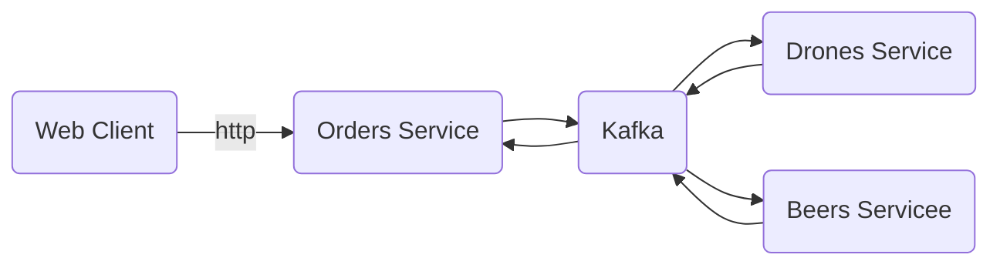

# Architecture



### Create topic

```bash
docker exec -it kafka /opt/bitnami/kafka/bin/kafka-topics.sh --create --bootstrap-server localhost:9092 --replication-factor 1 --partitions 1 --topic test
```

### [Inspiration](https://github.com/kriscfoster/node-kafka-producer-consumer)

### Mongo for the local run of the monorepo

```bash
docker run -d -p 27017:27017 --name example-mongo mongo:latest
```
